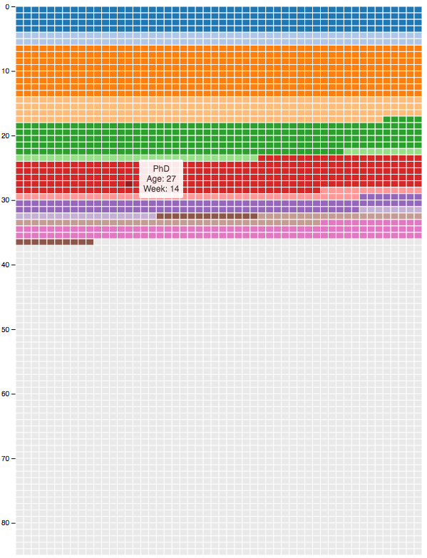

# My life in weeks

[This interactive visualization](http://vpascual.org/projects/my-life-in-weeks/) follows the visualization suggested by the great blog [Wait But Why](http://waitbutwhy.com) in their post [Your Life in Weeks](http://waitbutwhy.com/2014/05/life-weeks.html).

Each row represents a year in my life, out of the expected 85 years I'm meant to life (fingers crossed!). Rows are divided in the 52 weeks that each year has. Colors are assigned according to the different 'seasons' of my life. From my early years until now. Some seasons have a link attached to it, so clicking on any week of that period will show a reference on what I was doing or where I was doing it.

This project has been developed using [AngularJS v1.4](https://angularjs.org) and [D3 v4](https://d3js.org).

The source code of this project can be found in [Github](https://github.com/vpascual/Life-Weeks)

